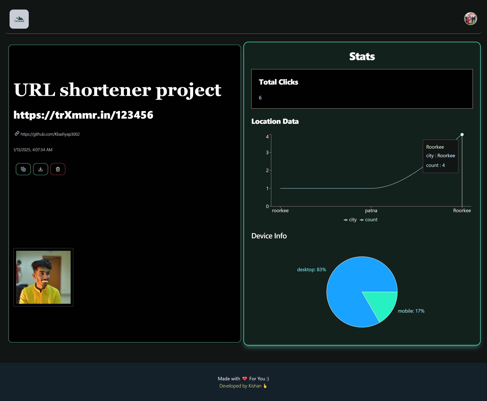
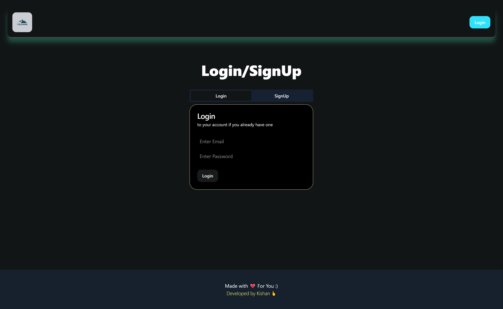
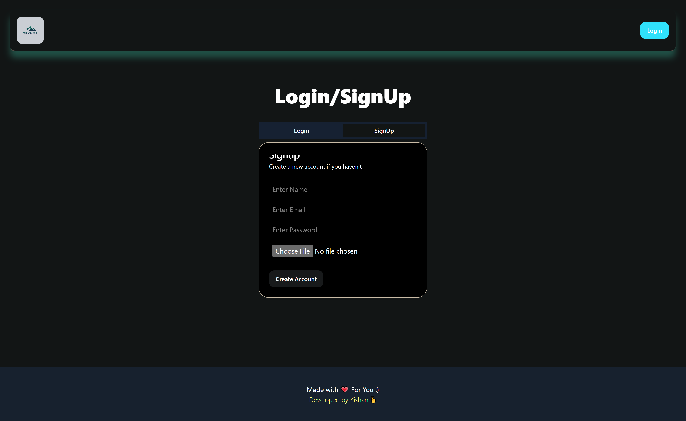
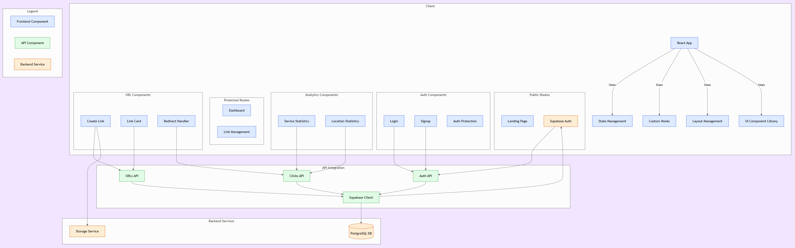

# URL Shortener


## Overview
Welcome to the URL Shortener project! This application allows users to shorten long URLs, generate QR codes for easy sharing, and track analytics such as click counts, device types, and geographical locations of the clicks. Built with React and powered by Supabase, this project provides a seamless user experience for managing and analyzing shortened URLs.


## Features

- **URL Shortening**: Easily convert long URLs into short, manageable links.
- **QR Code Generation**: Automatically generate QR codes for each shortened URL for quick access.
- **User Authentication**: Secure user accounts with login and signup functionality.
- **Analytics Dashboard**: View detailed statistics on URL clicks, including:
  - Total clicks
  - Device types (desktop, mobile, etc.)
  - Geolocation data (city and country)
- **Responsive Design**: Optimized for both desktop and mobile devices.

  
## Tech Stack

- **Frontend**:
  - React
  - Tailwind CSS for styling
  - Recharts for data visualization
    
- **Backend**: 
  - Supabase (PostgreSQL database, authentication, and storage)
    
- **Additional Libraries**:
  - `react-spinners` for loading indicators
  - `lucide-react` for icons
  - `ua-parser-js` for device detection


  
## Getting Started

### Prerequisites
- Node.js (v14 or higher)
- npm or yarn
- Supabase account


### Installation


1. **Clone the repository**:
   ```bash
   git clone https://github.com/yourusername/url-shortener.git
   cd url-shortener
   ```

2. **Install dependencies**:
   ```bash
   npm install
   # or
   yarn install
   ```

3. **Set up Supabase**:
   - Create a new project in Supabase.
   - Set up the database tables for URLs and clicks as per the schema defined in 
     the project.
   - Obtain your Supabase URL and API key from the project settings.

4. **Configure environment variables**:
   Create a `.env` file in the root of the project and add your Supabase 
   credentials:
   VITE_SUPABASE_URL=your_supabase_url
   VITE_SUPABASE_KEY=your_supabase_key


5. **Run the application**:
   ```bash
   npm run dev
   # or
   yarn dev
   ```

6. **Open your browser**:
   Navigate to `http://localhost:3000` to view the application.


## User Journey
### 1. Landing Page
The landing page introduces the URL Shortener and provides a field to enter long URLs for shortening.


### 2. URL Shortening
Users can enter a long URL and click the "Shorten it!" button to generate a shortened link.


### 3. Dashboard
After logging in, users can view their dashboard, which displays the total clicks and a list of their shortened links.


### 4. URL Stats
Clicking on a shortened URL will show detailed statistics, including total clicks, location data, and device information.


### 5. Login/Signup
Users can create an account or log in to access their shortened URLs and analytics.



## gitDiagram: 



## Contributing
Contributions are welcome! If you have suggestions for improvements or new features, please open an issue or submit a pull request.


## License
This project is licensed under the MIT License. See the [LICENSE](LICENSE) file for details.


## Acknowledgments
- Thanks to the Supabase team for providing an excellent backend service.
- Special thanks to the open-source community for the libraries and tools that made this project possible.
